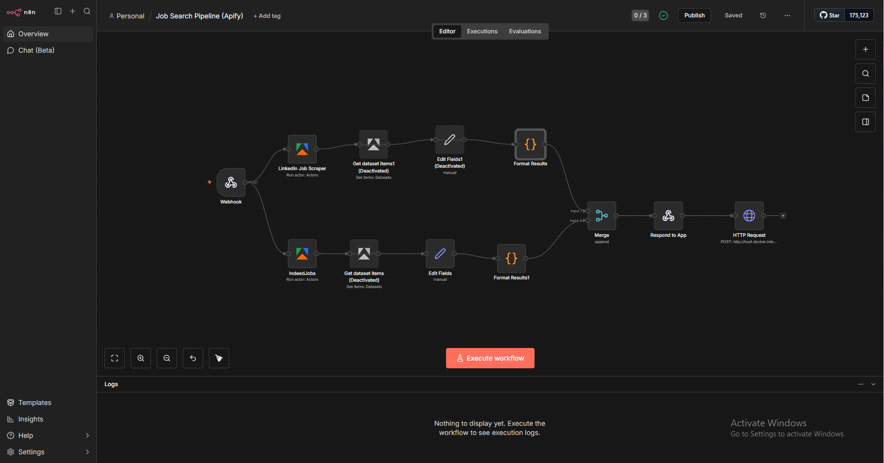
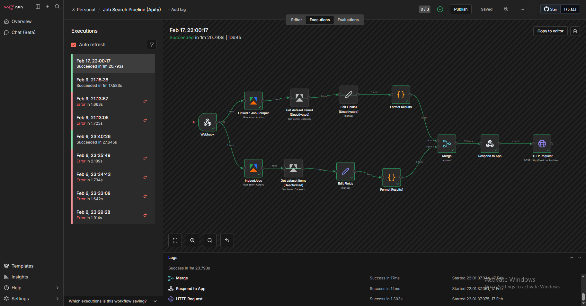
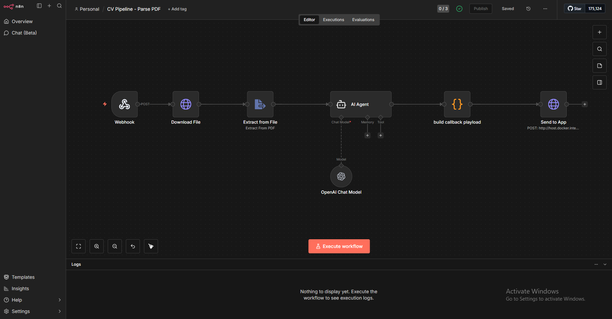
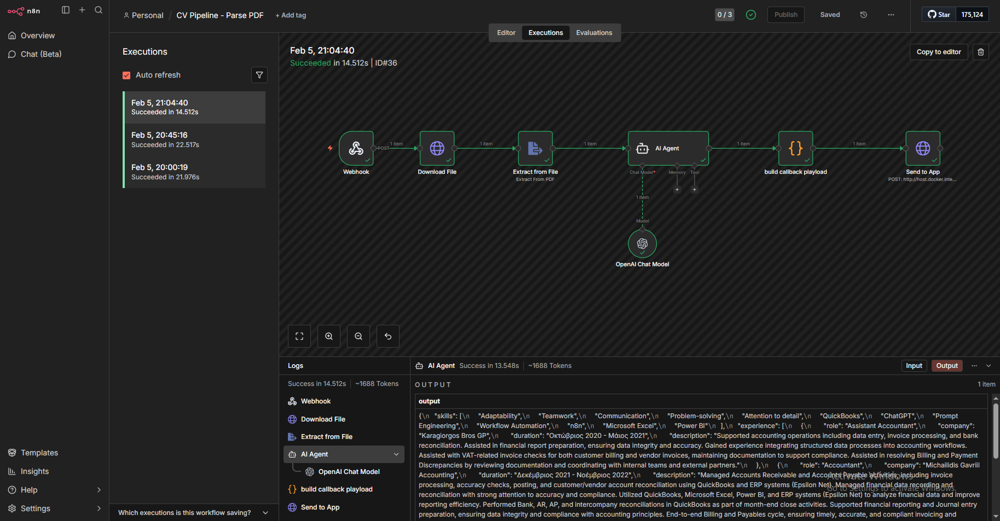
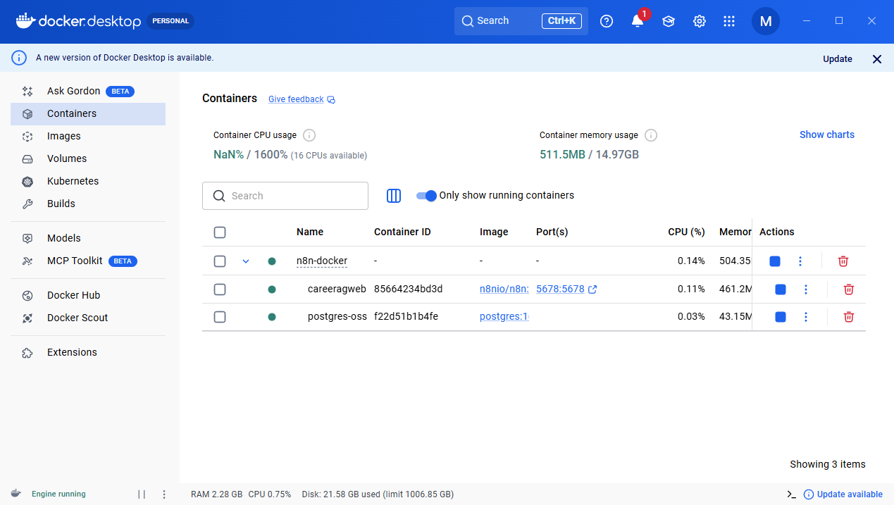

<p align="center">
  
  
  
  
  
</p>

<p align="center">
  
  
  
  
  
</p>

<h1 align="center">CareerAg</h1>

<p align="center">
  <strong>AI-powered career management platform for job matching, skill gap analysis, and application optimization</strong><br/>
  Upload your CV, search for jobs, and get AI-driven insights to land your next role.
</p>

<p align="center">
  <a href="https://career-ag-web-r9y0agrpy-aimilios-projects-21450502.vercel.app" target="_blank"><strong>View Live Demo</strong></a>
</p>

<p align="center">
  <a href="#features">Features</a> •
  <a href="#live-demo">Demo</a> •
  <a href="#tech-stack">Tech Stack</a> •
  <a href="#architecture">Architecture</a> •
  <a href="#n8n-workflows">n8n Workflows</a> •
  <a href="#getting-started">Getting Started</a> •
  <a href="#deployment">Deployment</a> •
  <a href="#license">License</a>
</p>

---

## Overview

CareerAg is a full-stack career management web application that helps professionals find their ideal job matches through AI-powered CV analysis and semantic search. The platform parses uploaded CVs with OpenAI, generates vector embeddings stored in Pinecone for semantic job matching, and provides detailed skill gap analysis and suitability scores. Premium users get access to AI-generated cover letters, interview preparation, and tailored CV generation via Stripe-gated Pro features.

**Key Highlights:**
- End-to-end job matching pipeline: CV upload → AI parsing → vector embedding → semantic search → scored matches
- 3-tier fallback architecture: n8n workflows → direct OpenAI API → mock data for development
- 541 tests passing across unit, integration, and E2E test suites
- Production-ready with Supabase RLS, Stripe billing, and Vercel deployment

---

## Features

| Feature | Description |
|---------|-------------|
| **CV Upload & Parsing** | Upload PDF/DOCX CVs with drag-and-drop, parsed by OpenAI GPT-4o-mini into structured data |
| **AI Job Matching** | Semantic matching between CV embeddings and job listings using Pinecone vector search |
| **Semantic Search** | Natural language job search with vector-based ranking beyond simple keyword matching |
| **Skill Gap Analysis** | Visual breakdown of matching vs missing skills per job, with improvement suggestions |
| **CV Analysis Dashboard** | Comprehensive view of parsed CV data — skills, experience, education, and match readiness |
| **Cover Letter Generation** | Pro feature: AI-generated cover letters tailored to specific job descriptions |
| **Interview Preparation** | Pro feature: AI-generated interview questions based on job requirements and your CV |
| **Tailored CV Generation** | Pro feature: Optimized CV rewrite targeting a specific job posting |
| **Stripe Payments** | Subscription management with checkout, customer portal, and webhook handling |
| **Saved Searches & Alerts** | Save job search criteria and rerun them later with one click |
| **Trending & Discovery** | Browse trending job categories and popular search terms |

---

## Live Demo

**Production URL:** [https://career-ag-web-r9y0agrpy-aimilios-projects-21450502.vercel.app](https://career-ag-web-r9y0agrpy-aimilios-projects-21450502.vercel.app)

---

## Tech Stack

### Frontend
| Technology | Purpose |
|------------|---------|
|  | React framework with App Router & Server Components |
|  | Type-safe development across the full stack |
|  | Utility-first CSS with dark theme design system |
|  | Accessible, composable UI component library |
|  | Lightweight state management for client-side stores |
|  | Modern icon library |

### Backend & Services
| Technology | Purpose |
|------------|---------|
|  | Auth, PostgreSQL database, Row Level Security, file storage |
|  | CV parsing, cover letter generation, interview prep, embeddings |
|  | Vector database for semantic CV-to-job matching |
|  | Subscription billing, checkout sessions, customer portal |
|  | Workflow automation for job scraping and search orchestration |
|  | Job board scraping via n8n integration |

### DevOps & Infrastructure
| Technology | Purpose |
|------------|---------|
|  | Containerized n8n + PostgreSQL for workflow automation |
|  | Frontend hosting, serverless API routes, CI/CD |
|  | Version control & repository |
|  | Unit & integration testing (541 tests) |
|  | End-to-end browser testing |

---

## Architecture

The application follows a serverless architecture with Supabase as the central data hub and n8n for external service orchestration.

```
┌──────────────────────────────────────────────────────────────────────────────┐
│                                    USER                                      │
│                    Uploads CV  •  Searches Jobs  •  Views Matches            │
└──────────────────────────────────┬───────────────────────────────────────────┘
                                   │
                                   ▼
┌──────────────────────────────────────────────────────────────────────────────┐
│                        NEXT.JS FRONTEND (Vercel)                             │
│  ┌────────────────┐  ┌────────────────┐  ┌────────────────────────────────┐ │
│  │   Dashboard    │  │   Job Search   │  │     Pro Features               │ │
│  │  • CV Upload   │  │  • Search Bar  │  │  • Cover Letter Generator      │ │
│  │  • CV Analysis │  │  • Match Cards │  │  • Interview Prep              │ │
│  │  • Profile     │  │  • Skill Gaps  │  │  • Tailored CV                 │ │
│  └────────────────┘  └────────────────┘  └────────────────────────────────┘ │
└──────────────────────────────────┬───────────────────────────────────────────┘
                                   │ API Routes (/api/*)
                                   ▼
┌──────────────────────────────────────────────────────────────────────────────┐
│                          NEXT.JS API LAYER                                   │
│                                                                              │
│  ┌──────────┐  ┌──────────┐  ┌──────────┐  ┌──────────┐  ┌──────────────┐ │
│  │ /api/cv  │  │ /api/jobs│  │/api/stripe│  │/api/cover│  │ /api/saved-  │ │
│  │ upload   │  │ search   │  │ checkout  │  │ letter   │  │  searches    │ │
│  │ parse    │  │ [id]     │  │ portal    │  │ generate │  │  [id]/rerun  │ │
│  │ embed    │  │ semantic │  │ webhook   │  │          │  │              │ │
│  │ generate │  │ rank     │  │          │  │          │  │              │ │
│  └────┬─────┘  └────┬─────┘  └────┬─────┘  └────┬─────┘  └──────┬───────┘ │
└───────┼──────────────┼──────────────┼──────────────┼──────────────┼─────────┘
        │              │              │              │              │
        ▼              ▼              ▼              ▼              ▼
┌──────────────┐ ┌────────────────┐ ┌──────────┐ ┌──────────────┐ ┌────────────┐
│   SUPABASE   │ │  N8N (Docker)  │ │  STRIPE  │ │   OPENAI     │ │  PINECONE  │
│  • Auth      │ │  • Webhooks    │ │ Billing  │ │  GPT-4o-mini │ │ Vector DB  │
│  • Database  │ │  • Search      │ │ Payments │ │  Embeddings  │ │ 1536 dims  │
│  • Storage   │ │  • Scrape      │ │          │ │  text-emb-3  │ │            │
│  • RLS       │ │  • Apify       │ │          │ │              │ │            │
│              │ │  + PostgreSQL  │ │          │ │              │ │            │
└──────────────┘ └────────────────┘ └──────────┘ └──────────────┘ └────────────┘
```

### 3-Tier Fallback Architecture

The system is designed to work across environments with graceful degradation:

| Tier | Service | When Used |
|------|---------|-----------|
| **Tier 1** | n8n Webhooks | Production — full workflow orchestration via n8n + Apify |
| **Tier 2** | Direct OpenAI API | When n8n is unavailable — direct API calls to OpenAI/Pinecone |
| **Tier 3** | Mock Data | Development — realistic mock responses for local testing |

### Data Flow

1. **CV Upload** → User uploads PDF/DOCX → stored in Supabase Storage
2. **CV Parsing** → OpenAI GPT-4o-mini extracts skills, experience, education into structured JSON
3. **Embedding** → `text-embedding-3-small` generates 1536-dim vector → stored in Pinecone
4. **Job Search** → User enters search query → n8n triggers Apify scraping → results stored in Supabase
5. **Semantic Matching** → CV embedding compared against job embeddings → cosine similarity scores
6. **Results** → Matched jobs displayed with suitability %, skill gap analysis, and actionable insights

---

## Project Structure

```
CareerAgWebApp/
│
├── src/
│   ├── app/                        # Next.js App Router
│   │   ├── (auth)/                 # Auth pages
│   │   │   ├── login/              # Email/password + Google OAuth
│   │   │   ├── signup/             # Registration with email confirmation
│   │   │   ├── forgot-password/    # Password recovery
│   │   │   └── reset-password/     # Password reset flow
│   │   ├── (dashboard)/            # Protected dashboard pages
│   │   │   └── dashboard/
│   │   │       ├── page.tsx        # Main dashboard
│   │   │       ├── jobs/           # Job search & match details
│   │   │       ├── cv-analysis/    # CV parsing results
│   │   │       ├── pro/            # Premium features
│   │   │       ├── profile/        # User profile
│   │   │       ├── saved-searches/ # Saved search management
│   │   │       ├── history/        # Search history
│   │   │       ├── trending/       # Trending jobs & categories
│   │   │       └── alerts/         # Job alerts
│   │   ├── api/                    # API routes (15+ endpoints)
│   │   │   ├── cv/                 # Upload, parse, embed, generate
│   │   │   ├── jobs/               # Search, details, semantic rank
│   │   │   ├── stripe/             # Checkout, portal, webhook
│   │   │   ├── cover-letter/       # AI cover letter generation
│   │   │   ├── interview/          # AI interview questions
│   │   │   ├── saved-searches/     # CRUD + rerun
│   │   │   ├── matches/            # Job match results
│   │   │   ├── searches/           # Search history
│   │   │   └── profile/            # User profile management
│   │   ├── layout.tsx              # Root layout
│   │   └── page.tsx                # Landing page
│   │
│   ├── components/
│   │   ├── ui/                     # shadcn/ui base components
│   │   ├── dashboard/              # Dashboard-specific components
│   │   ├── jobs/                   # Job cards, skill badges, gap analysis
│   │   ├── cv-analysis/            # CV parsing visualizations
│   │   └── pro/                    # Premium feature components
│   │
│   ├── lib/
│   │   ├── supabase/               # Server & admin clients
│   │   ├── openai/                 # GPT-4o-mini integration
│   │   ├── pinecone/               # Vector search client
│   │   ├── stripe/                 # Payment handling
│   │   ├── n8n/                    # Webhook triggers
│   │   └── auth/                   # Auth utilities
│   │
│   ├── hooks/                      # Custom React hooks (10+)
│   ├── stores/                     # Zustand state stores
│   └── types/                      # TypeScript types (Supabase generated)
│
├── __tests__/                      # Test suites (541 tests)
├── docs/
│   ├── n8n/                        # n8n workflow JSONs, screenshots & environment docs
│   └── screenshots/                # UI screenshots (desktop, tablet, mobile)
├── specs/                          # PRD, plan, context, guidelines, PROGRESS
├── .env.example                    # Environment variable template
├── CLAUDE.md                       # AI assistant guidelines
├── package.json                    # Dependencies & scripts
├── tailwind.config.ts              # Tailwind configuration
├── tsconfig.json                   # TypeScript configuration
└── vitest.config.ts                # Test configuration
```

---

## Getting Started

### Prerequisites

| Requirement | Version | Purpose |
|-------------|---------|---------|
| Node.js | 18+ | JavaScript runtime |
| npm | 9+ | Package manager |
| Docker Desktop | Latest | Runs n8n + PostgreSQL containers for workflow automation |
| Supabase CLI | Latest | Local database development |

### API Keys Required

- **Supabase** — Project URL, anon key, service role key
- **OpenAI** — API key for GPT-4o-mini and text-embedding-3-small
- **Pinecone** — API key and index name (1536 dimensions)
- **Stripe** — Secret key, publishable key, webhook secret
- **n8n** — Webhook base URL and secret (optional for local dev)

### Setup

```bash
# Clone the repository
git clone https://github.com/Aimilios94/CareerAgWebApp.git
cd CareerAgWebApp

# Install dependencies
npm install

# Copy environment template and fill in your keys
cp .env.example .env.local

# Start development server
npm run dev
```

The application will be available at `http://localhost:3000`

### Available Scripts

```bash
npm run dev          # Start development server
npm run build        # Production build
npm run lint         # Run ESLint
npm run test         # Run Vitest in watch mode
npm run test:run     # Run all tests once
npm run test:coverage # Run tests with coverage report
npm run test:e2e     # Run Playwright E2E tests
```

---

## n8n Workflows

The app uses two n8n workflows for backend automation. Import the JSON files from [`docs/n8n/`](docs/n8n/) into your n8n instance.

### Job Search Pipeline (Apify)

Scrapes LinkedIn and Indeed job boards via Apify, merges and formats results, then sends them back to the app via HTTP callback.

<p align="center">
  
</p>

<p align="center"><em>Webhook → Apify Scrapers (LinkedIn + Indeed) → Format & Merge → Respond to App</em></p>

| Stage | Nodes | Description |
|-------|-------|-------------|
| **Trigger** | Webhook | Receives POST from the app with search query and filters |
| **Scraping** | LinkedIn Job Scraper, IndeedJobs | Parallel Apify actors scrape both job boards |
| **Processing** | Get Dataset Items → Edit Fields → Format Results | Extracts and normalizes job data from each source |
| **Output** | Merge → Respond to App → HTTP Request | Combines results and sends back to the app callback URL |

<p align="center">
  
</p>

<p align="center"><em>Successful execution — completed in ~1m 20s with results from both job boards</em></p>

---

### CV Pipeline — Parse PDF

Downloads the uploaded CV, extracts text from PDF, uses an AI Agent with OpenAI to parse skills and experience into structured JSON, then sends the result back to the app.

<p align="center">
  
</p>

<p align="center"><em>Webhook → Download File → Extract from PDF → AI Agent (OpenAI) → Build Payload → Send to App</em></p>

| Stage | Nodes | Description |
|-------|-------|-------------|
| **Trigger** | Webhook | Receives POST with CV file URL from the app |
| **Download** | Download File | Fetches the PDF from Supabase Storage |
| **Extract** | Extract from File | Extracts raw text content from the PDF |
| **AI Parse** | AI Agent + OpenAI Chat Model | GPT-4o parses CV text into structured JSON (skills, experience, education) |
| **Output** | Build Callback Payload → Send to App | Formats and sends parsed data back to the app |

<p align="center">
  
</p>

<p align="center"><em>Successful execution — CV parsed in ~14s, extracting skills, experience, and education</em></p>

---

### Workflow Setup

n8n runs locally via **Docker**, alongside a dedicated PostgreSQL container for workflow persistence. The setup uses Docker Desktop with two containers managed under a single stack:

<p align="center">
  
</p>

<p align="center"><em>Docker Desktop showing the n8n container (n8nio/n8n on port 5678) and PostgreSQL container running side by side</em></p>

1. Install [Docker Desktop](https://www.docker.com/products/docker-desktop/) and ensure it is running
2. Start the n8n Docker stack (n8n + PostgreSQL containers):
   ```bash
   docker compose up -d
   ```
3. Access n8n at `http://localhost:5678`
4. Import the workflow JSON files from [`docs/n8n/`](docs/n8n/)
5. Configure credentials (Supabase, OpenAI, Apify)
6. Activate the workflows and note the webhook URLs
7. Set `N8N_WEBHOOK_BASE_URL=http://localhost:5678` in your environment variables

> **Note:** The app works without n8n using the 3-tier fallback — direct OpenAI API calls handle CV parsing and matching when n8n is unavailable.

---

## Deployment

### Vercel Deployment

1. **Push to GitHub**
   ```bash
   git push origin main
   ```

2. **Import to Vercel**
   - Go to [vercel.com](https://vercel.com) → Add New Project
   - Import your GitHub repository
   - Framework Preset: **Next.js** (auto-detected)

3. **Set Environment Variables**

   | Variable | Description |
   |----------|-------------|
   | `NEXT_PUBLIC_SUPABASE_URL` | Your Supabase project URL |
   | `NEXT_PUBLIC_SUPABASE_ANON_KEY` | Supabase anonymous key |
   | `SUPABASE_SERVICE_ROLE_KEY` | Supabase service role key (server-only) |
   | `OPENAI_API_KEY` | OpenAI API key |
   | `PINECONE_API_KEY` | Pinecone API key |
   | `PINECONE_INDEX_NAME` | Pinecone index name |
   | `STRIPE_SECRET_KEY` | Stripe secret key |
   | `STRIPE_PUBLISHABLE_KEY` | Stripe publishable key |
   | `STRIPE_WEBHOOK_SECRET` | Stripe webhook signing secret |
   | `N8N_WEBHOOK_BASE_URL` | n8n webhook base URL |
   | `N8N_WEBHOOK_SECRET` | n8n webhook authentication secret |
   | `NEXT_PUBLIC_APP_URL` | Your Vercel deployment URL |

4. **Deploy** — Vercel auto-deploys on every push to main

### Post-Deployment Configuration

| Service | Action Required |
|---------|-----------------|
| **Stripe** | Register webhook at `https://<your-domain>/api/stripe/webhook` for `checkout.session.completed` and `customer.subscription.*` events |
| **Supabase** | Verify RLS policies are active; add Vercel domain to Auth redirect URLs |
| **Pinecone** | Ensure index exists with 1536 dimensions (for `text-embedding-3-small`) |
| **n8n** | Deploy Docker containers (`docker compose up -d`), import workflows, set webhook URLs, configure Apify credentials |

---

## Design Principles

| Principle | Implementation |
|-----------|----------------|
| **Dark Theme** | High contrast dark color scheme with subtle gradients and accent colors |
| **Glassmorphism** | Frosted glass card effects with backdrop-blur and transparency |
| **Responsive** | Mobile-first layouts with sidebar navigation collapsing to mobile nav |
| **Accessible** | Semantic HTML, keyboard navigation, WCAG AA color contrast targets |
| **Type-Safe** | Full TypeScript coverage with Supabase-generated database types |

---

## API Reference

### Authentication
| Method | Path | Description | Auth |
|--------|------|-------------|------|
| `GET` | `/api/auth/callback` | OAuth callback handler | Public |

### CV Management
| Method | Path | Description | Auth |
|--------|------|-------------|------|
| `POST` | `/api/cv/upload` | Upload CV file (PDF/DOCX) | Required |
| `POST` | `/api/cv/parse` | Parse CV with OpenAI | Required |
| `POST` | `/api/cv/embed` | Generate CV embedding | Required |
| `POST` | `/api/cv/generate` | Generate tailored CV | Pro |

### Job Search
| Method | Path | Description | Auth |
|--------|------|-------------|------|
| `POST` | `/api/jobs/search` | Trigger job search via n8n | Required |
| `GET` | `/api/jobs/search/[searchId]` | Get search results | Required |
| `GET` | `/api/jobs/[id]` | Get job details | Required |
| `POST` | `/api/jobs/semantic-rank` | Semantic ranking of matches | Required |

### Pro Features
| Method | Path | Description | Auth |
|--------|------|-------------|------|
| `POST` | `/api/cover-letter/generate` | Generate cover letter | Pro |
| `POST` | `/api/interview/questions` | Generate interview questions | Pro |

### Payments
| Method | Path | Description | Auth |
|--------|------|-------------|------|
| `POST` | `/api/stripe/checkout` | Create checkout session | Required |
| `POST` | `/api/stripe/portal` | Create billing portal session | Required |
| `POST` | `/api/stripe/webhook` | Stripe webhook handler | Webhook |

### User Data
| Method | Path | Description | Auth |
|--------|------|-------------|------|
| `GET/PUT` | `/api/profile` | Get/update user profile | Required |
| `GET/POST` | `/api/saved-searches` | List/create saved searches | Required |
| `GET/DELETE` | `/api/saved-searches/[id]` | Get/delete saved search | Required |
| `POST` | `/api/saved-searches/[id]/rerun` | Rerun a saved search | Required |
| `GET` | `/api/matches` | Get job matches | Required |
| `GET` | `/api/searches` | Get search history | Required |

### Webhooks
| Method | Path | Description | Auth |
|--------|------|-------------|------|
| `POST` | `/api/webhooks/n8n` | Receive n8n workflow results | Secret |

---

## Roadmap

- [ ] Real-time job alert notifications (email/push)
- [ ] Multiple CV profiles per user
- [ ] Application tracking system (ATS)
- [ ] Company research and salary insights
- [ ] LinkedIn profile import
- [ ] Resume template library
- [ ] Team/recruiter portal
- [ ] Mobile app (React Native)

---

## Contributing

Contributions are welcome! Please feel free to submit a Pull Request.

1. Fork the repository
2. Create your feature branch (`git checkout -b feature/AmazingFeature`)
3. Commit your changes (`git commit -m 'Add some AmazingFeature'`)
4. Push to the branch (`git push origin feature/AmazingFeature`)
5. Open a Pull Request

---

## License

This project is licensed under the MIT License - see the [LICENSE](LICENSE) file for details.

---

## Acknowledgments

- [Next.js](https://nextjs.org) for the React framework with App Router
- [Supabase](https://supabase.com) for authentication, database, and storage
- [OpenAI](https://openai.com) for GPT-4o-mini and text-embedding-3-small
- [Pinecone](https://pinecone.io) for vector search and semantic matching
- [Stripe](https://stripe.com) for subscription billing
- [n8n](https://n8n.io) for workflow automation
- [Docker](https://www.docker.com) for containerized n8n and PostgreSQL
- [shadcn/ui](https://ui.shadcn.com) for accessible UI components
- [Vercel](https://vercel.com) for seamless deployment

---

<p align="center">
  <strong>Built with AI-powered automation and modern web technologies</strong><br/>
  <a href="https://github.com/Aimilios94">@Aimilios94</a>
</p>
